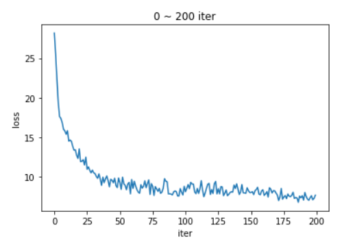
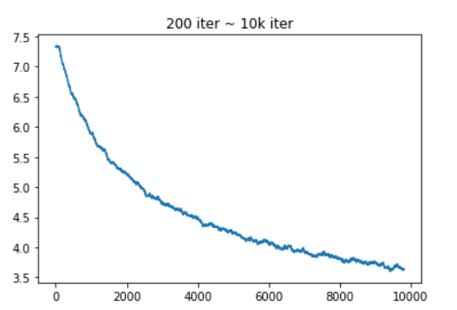
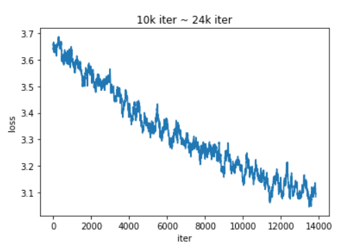

# PyTorch_SSD
Now it's training on a K80, iter 24k

# Current
- Current mAP: 0.692 (Expected 0.772)
- Current iteration number: 24k
- Train from pretrained vgg weight
- With data augmentation
- Training dataset: Pascal 07 + 12
- Val dataset: Pascal 07test
- Train log: res.json

# How to use it
1. Update config.py, set paths
2. Command line: `python train.py`
- [You can download pretrained vgg weight here](https://s3.amazonaws.com/amdegroot-models/ssd300_mAP_77.43_v2.pth).
- [You can download annotation file in json format here](https://storage.googleapis.com/coco-dataset/external/PASCAL_VOC.zip)
- [You can download Pascal dataset here](https://pjreddie.com/projects/pascal-voc-dataset-mirror/)
- It's still dirty code, wait to refine

# Reference
- https://github.com/fastai/fastai
- https://github.com/amdegroot/ssd.pytorch
- Liu, Wei, et al. "SSD: Single shot multibox detector." European conference on computer vision. Springer, Cham, 2016.

# Loss Curve
- Training dataset only
- Exponentially weighted average

